#### 项目1

##### 街道模式和导航
| 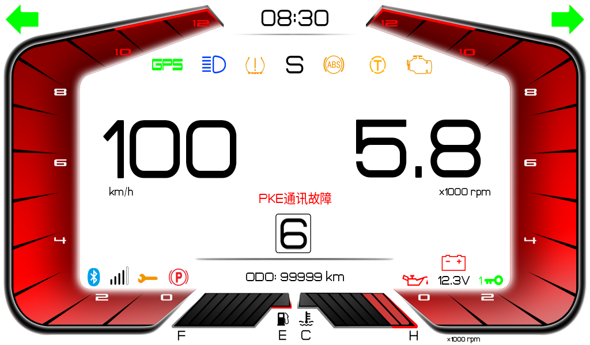 | 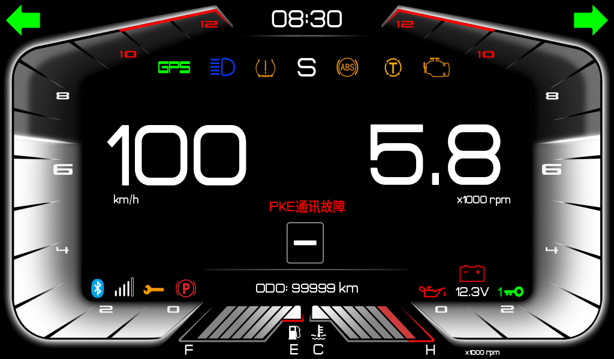 | 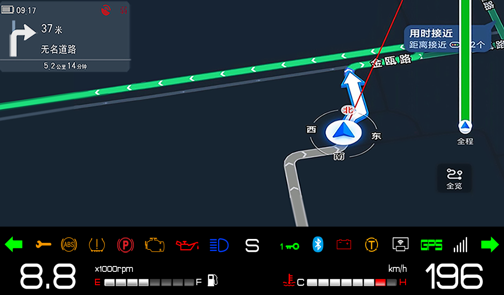|
|---|---|---|

##### 竞速模式
| 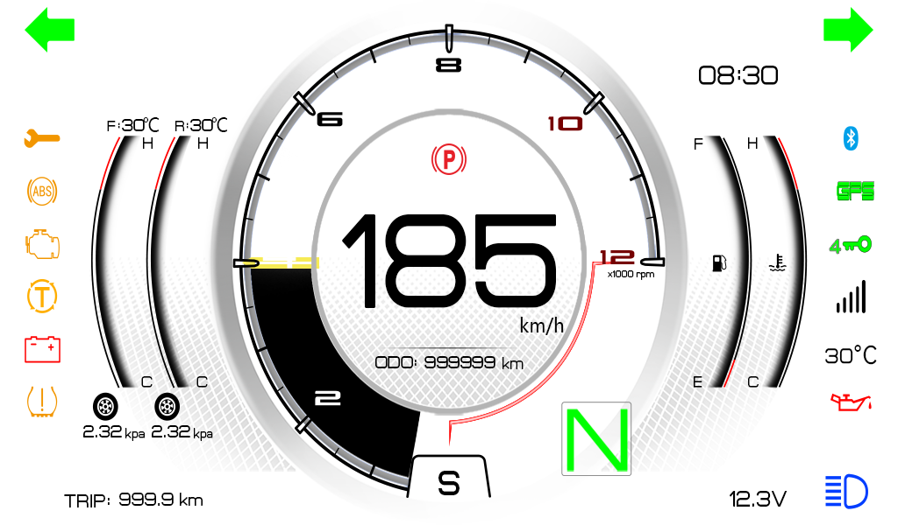 | 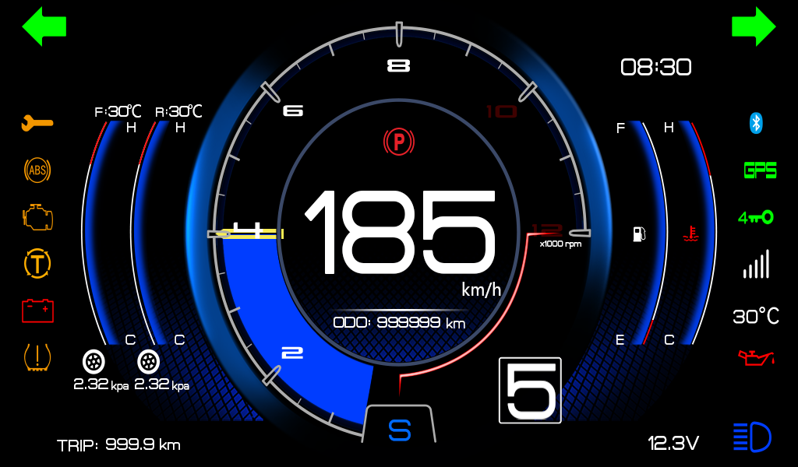 |
|---|---|

##### 休闲模式
| 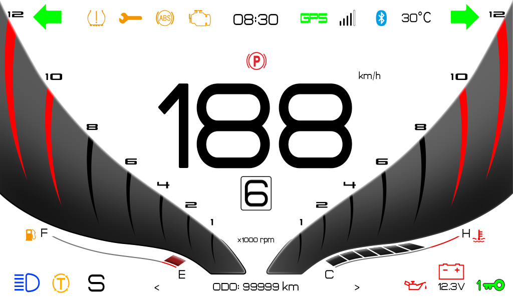 | 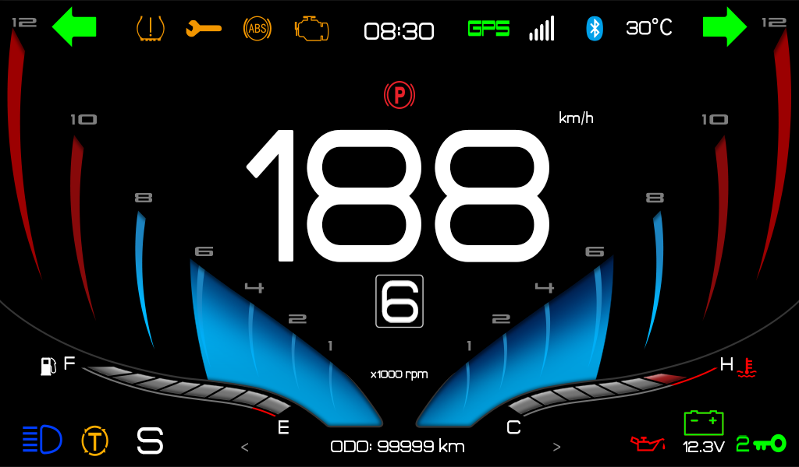 |
|---|---|

##### 简约模式
| 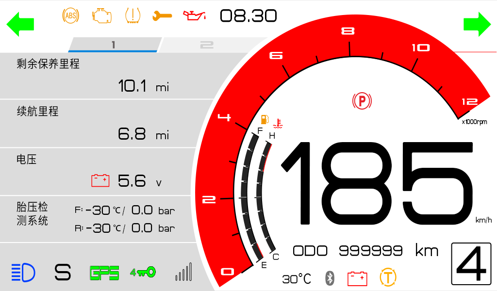 | 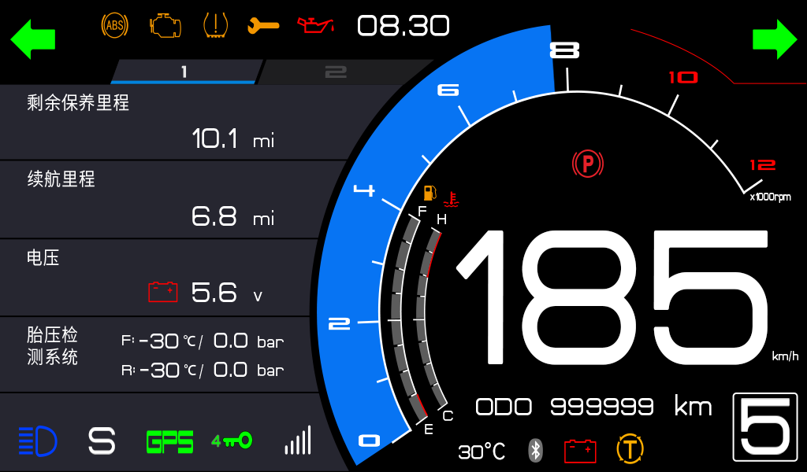 
|---|---|

#### 项目2
| 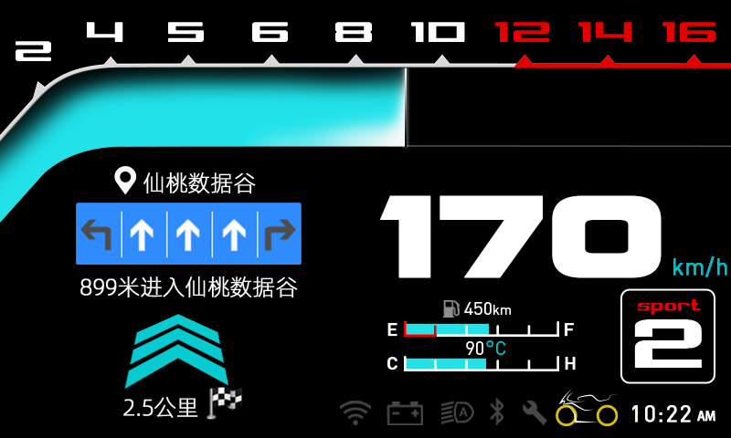 | 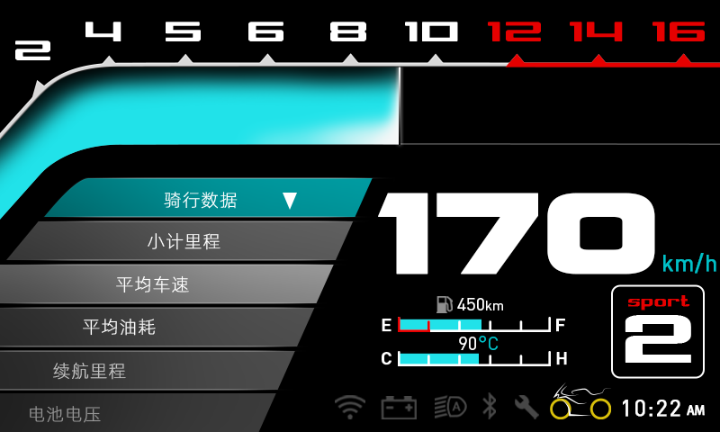 | 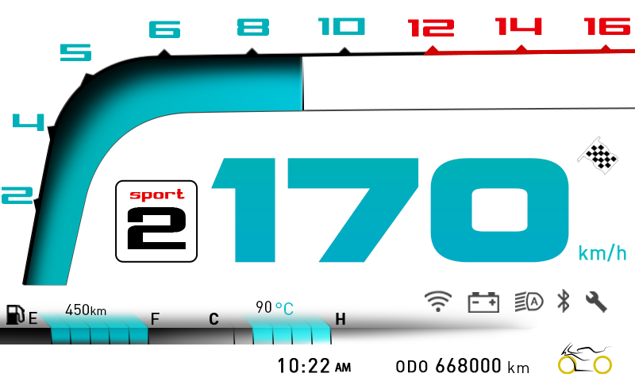| |
|---|---|---|---|

#### 项目3

##### ECO模式
| 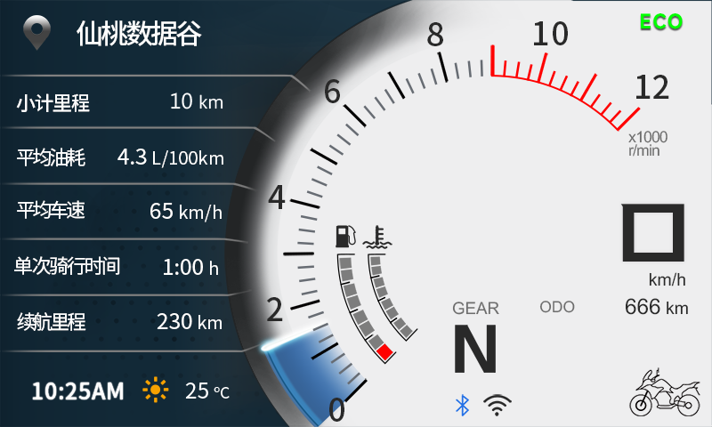 | 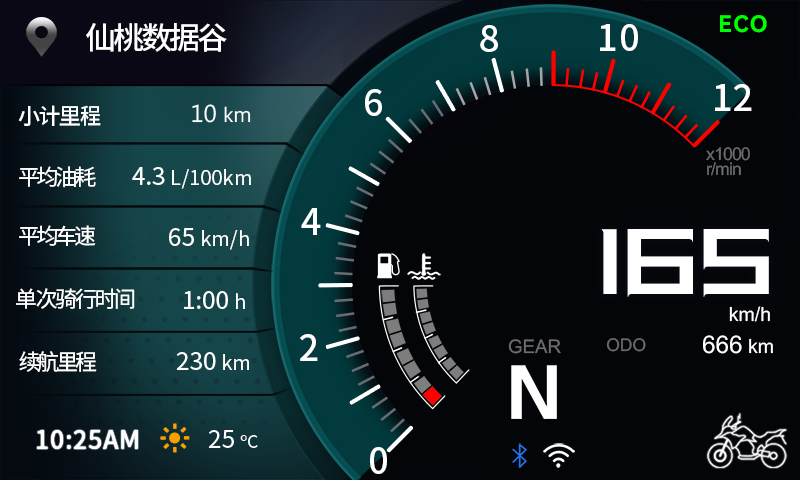 | 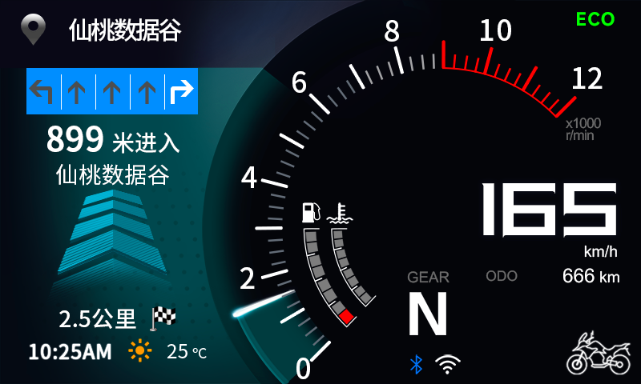|
|---|---|---|

##### SPORT模式
| 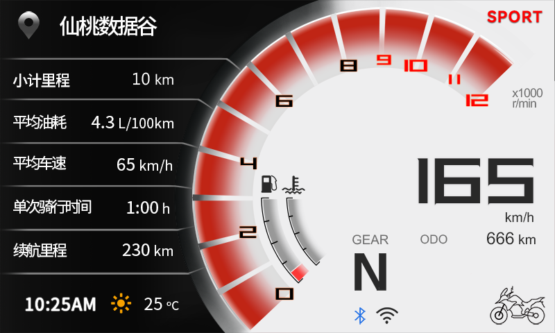 | 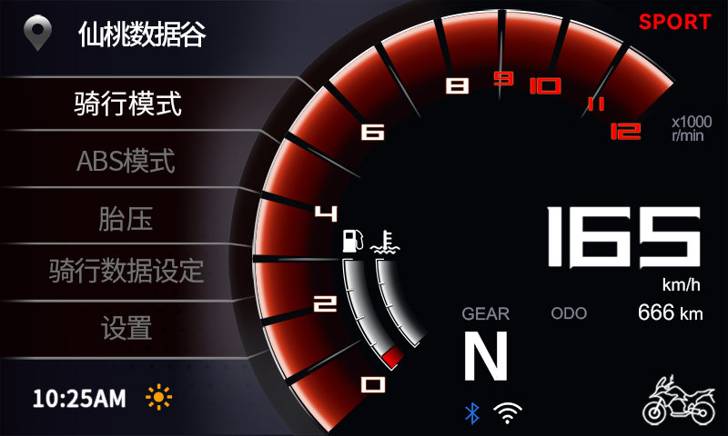 | 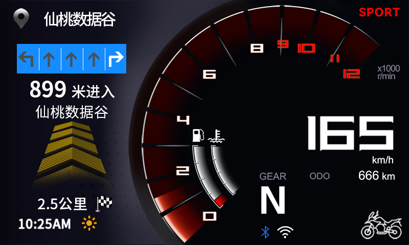|
|---|---|---|